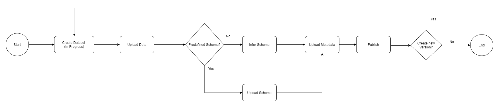

# Create and Publish a Dataset

In order to create a Dataset, you first need to Create an In Progress Dataset. In this stage you can make as many changes to the dataset as you want.

Once you are okay with the Data in the Dataset and want to make the Dataset Available to others, you can simply Publish the Dataset.

A published dataset is versioned and as such cannot be modified. In order to modify a published Dataset you will need to publish a new version by creating another In Progress Dataset, apply the new changes you'd like to make and then publish a new version.

Keep in mind that the old version is still available



## Getting Started
To Create a Dataset you will need to first [Create a Authentication Token](authentication.md)

The steps to publish a new Dataset are as follows

1. Create an In Progress Dataset
2. Upload the Data
3. Infer the Schema
4. Update the Metadata
5. Publish the Dataset


### Create an In Progress Dataset


```js
const data = { name: 'my-dataset' };

let fetchOptions = {
    method: 'POST', // or 'PUT'
    headers: {
        'Content-Type': 'application/json',
        'Authorization': 'bearer XXXXXXXXXXXXXXXX'
    },
    body: JSON.stringify(data),
}
fetch("https://api.edelweissdata.com/datasets", fetchOptions)
    .then(response => response.json())
    .then(data => {
        console.log('Success:', data);
    })
    .catch((error) => {
        console.error('Error:', error);
    });
```