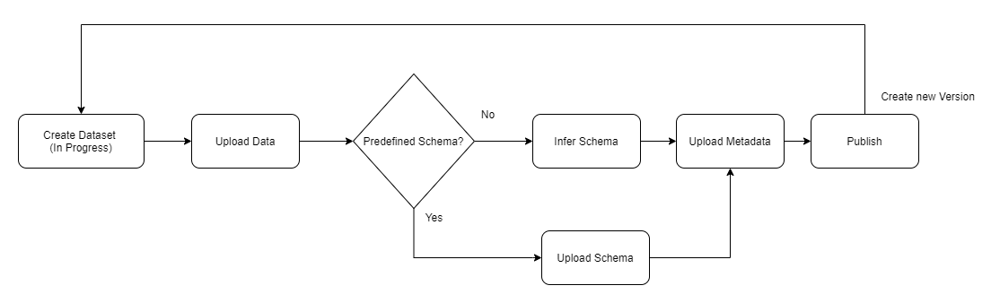

# Create and Publish a Dataset

An interactive version of this walkthrough exists as an [Observable notebook](https://observablehq.com/@danyx/edelweissdata-docs-create-and-publish-a-dataset?collection=@danyx/edelweissdata-interactive-documentation) that allows you to change parameters and see results instantaneously.

This walkthrough shows you how to create a new dataset from a csv file, including setting description and metadata and publishing the dataset. In later walkthroughs you will learn more about the details of the authentication scheme, the query language etc..

In order to create a dataset, you first need to create an In-Progress Dataset. In this stage you can make as many changes to the dataset as you want.

Once you are okay with the data in the dataset and want to make the dataset available to others, you can publish it, thus creating a new version.

A published dataset is versioned and as such cannot be modified. In order to modify a published dataset you will need to publish a new version by creating another In-Progress Dataset, apply the new changes you'd like to make and then publish a new version.

Keep in mind that the old version will still be available. When accessing datasets, you can specify in the URL if you want to retrieve the dataset at a specific version (identified by the integer version number starting at 1) or whatever is the latest published version.

**Dataset Lifecycle Flow**



For detailed information about specific endpoints of the Edelweiss API you can visit the [Swagger Docs](https://api.edelweissdata.com/docs/index.html)

## Getting Started
To Create a Dataset you will need to first [Create a Authentication Token](authentication)

The steps to publish a new Dataset are as follows

1. Create a Dataset
2. Upload the Data
3. Upload the Schema
4. Upload Metadata and Description
5. Set the visibility of the dataset
6. Publish the Dataset

For the rest of this walkthrough we will need to declare a few global constants

```js
let baseUrl = "https://api.edelweissdata.com"  // Points to the specific Edelweiss API url
let token = "XXXXXXXXXXXXXXXX"                          // Your API Token
let datasetid = null // variable to hold the datasetId once we create the dataset
```

So with that out of the way..

### Create a Dataset

Now we are ready to perform the call to the [/datasets/create](https://api.edelweissdata.com/docs/index.html#operations-Create-createInProgressDataset) endpoint. We have to supply an object with the name of the new dataset and make sure to set the authorization header is filled correctly

**Code**:
```js
const data = { name: 'my-dataset' };

const fetchOptions = {
    method: 'POST',
    headers: {
        'Content-Type': 'application/json',
        'Authorization': `bearer ${token}`
    },
    body: JSON.stringify(data),
}

const dataset = await fetch(`${baseUrl}/datasets/create`, fetchOptions)
    .then(response => response.json())
    .catch((error) => {
        console.error('Error:', error);
    });
const datasetId = dataset.id
console.log(dataset);
```

**Response:**

```json
{
   "id":"8e26dca9-477f-4d2f-b979-0a4b5763f359",
   "name":"my-dataset",
   "schema":null,
   "created":"2020-07-18T23:14:03.9818053+00:00",
   "description":"",
   "metadata":{},
   "dataSource":null
}
```

### Upload data to a Dataset

Now that we have created a dataset, we need to populate it with data. We need to read the csv and upload it as `multipart/form-data` with a POST request to the [/datasets/{datasetid}/in-progress/data/upload](https://api.edelweissdata.com/docs/index.html#operations-In_Progress-uploadDataToInProgressDataset) endpoint. The API expects the file to be passed as the `data` parameter

**Code:**

```js
let formData = new FormData();
formData.append("data", file)

let fetchOptions = {
    method: 'POST',
    headers: {
        'Authorization': `bearer ${token}`
    },
    body: formData,
}

fetch(`${baseUrl}/datasets/${datasetid}/in-progress/data/upload`, fetchOptions)
    .then(response => response.json())
    .then(data => {
        console.log('Success:', data);
    })
    .catch((error) => {
        console.error('Error:', error);
    });
```
**Response:**
```json
{
   "id":"8e26dca9-477f-4d2f-b979-0a4b5763f359",
   "name":"my-dataset",
   "schema":null,
   "created":"2020-07-19T10:04:59.9681770+00:00",
   "description":"",
   "metadata":{

   },
   "dataSource":null
}
```

### Upload the Schema

At this point we have our data stored as CSV in Edelweiss Data. However, It is currently stored as a bunch of string values in the Edelweiss Data.

In order to make the data interesting and allow Edelweiss Data make sense of it, we need to supply a schema.

The schema defines the datatype of the columns in the data. The data types could be simple Data Types like `string`, `integer` or they could be more advanced datatypes like `DateTime` or [Smiles](https://en.wikipedia.org/wiki/Simplified_molecular-input_line-entry_system)

Here are the list of Datatypes currently supported

| Data Type        | Representation                      |
| --               | --                                  |
| String           | xsd:string                          |
| Url              | xsd:anyURI                          |
| Boolean          | xsd:boolean                         |
| Integer          | xsd:integer                         |
| Float            | xsd:double                          |
| DateTime         | xsd:dateTime                        |
| Date             | xsd:date                            |
| DatasetId        | edelweiss:datasetid                 |
| SMILES           | cheminf:CHEMINF_000018              |
| Image            | https://schema.org/image            |
| Json             | http://edamontology.org/format_3464 |

There are currently two ways to define the Schema

1. Inference - We can tell Edelweiss to Infer the schema
2. Upload Schema - We supply the correct schema as json

#### Schema Inference

Edelweiss Data can infer the schema based on some heuristics. Schema inference can only infer basic information like the data type. If you use schema inference, consider augmenting the returned schema (e.g. with richer descriptions for each column if you have them) and uploading it again (see the Schema Upload section below for details)

To infer the schema, call the [/datasets/{datasetId}/in-progress/schema/infer](https://api.edelweissdata.com/docs/index.html#operations-In_Progress-inferSchemaOfInProgressDataset) endpoint as follows

**Code:**

```js
let fetchOptions = {
    method: 'POST',
    headers: {
        'Authorization': `bearer ${token}`
    }
}

fetch(`${baseUrl}/datasets/${datasetid}/in-progress/schema/infer`, fetchOptions)
    .then(response => response.json())
    .then(data => {
        console.log('Success:', data);
    })
    .catch((error) => {
        console.error('Error:', error);
    });
```
**Response:**
```json
{
   "id":"8e26dca9-477f-4d2f-b979-0a4b5763f359",
   "name":"my-dataset",
   "schema":{
      "columns":[
         {
            "name":"FirstName",
            "description":"",
            "dataType":"xsd:string",
            "visible":true
         },
         {
            "name":"LastName",
            "description":"",
            "dataType":"xsd:string",
            "visible": true
         }
      ]
   },
   "created":"2020-07-20T01:48:58.9086970+00:00",
   "description":"",
   "metadata":{

   },
   "dataSource":null
}
```

#### Schema Upload

The schema inference works very well for basic data types, however there are situations where you want fine grained control over the schema. To accomplish this you need to [construct a new json schema from scratch](https://api.edelweissdata.com/docs/index.html#model-Schema) or modify one returned by schema inference and then upload it by POSTing it to the [/datasets/{datasetId}/in-progress](https://api.edelweissdata.com/docs/index.html#operations-In_Progress-updateInProgressDataset) endpoint

**Code:**
```js
let data = {
    schema: {
        columns:
        [
            {
                "name": "FirstName",
                "dataType": "xsd:string",
                "description": "First Name"
            },
            {
                "name": "LastName",
                "dataType": "xsd:string",
                "description": "Last Name"
            }
        ]
    }
}

let fetchOptions = {
    method: 'POST',
    headers: {
        'Content-Type': 'application/json',
        'Authorization': `bearer ${token}`
    },
    body: JSON.stringify(data),
}

fetch(`${baseUrl}/datasets/${datasetid}/in-progress`, fetchOptions)
    .then(response => response.json())
    .then(data => console.log('Success:', data))
    .catch((error) => {
        console.error('Error:', error);
    });
```

**Response:**
```json
{
   "id":"8e26dca9-477f-4d2f-b979-0a4b5763f359",
   "name":"my-dataset",
   "schema":{
      "columns":[
         {
            "name":"FirstName",
            "description":"First Name",
            "dataType":"xsd:string",
            "visible":true
         },
         {
            "name":"LastName",
            "description":"Last Name",
            "dataType":"xsd:string",
            "visible": true
         }
      ]
   },
   "created":"2020-07-20T01:48:58.9086970+00:00",
   "description":"",
   "metadata":{

   },
   "dataSource":null
}
```

### Upload Metadata and Description

We have successfully inferred the schema; at this point we can move on to publish the dataset. To make our dataset more useful though, it is a good idea to to add a few additional pieces of information. They are:

1. Description - Markdown textual description to help users understand what the data is about
2. Metadata - A Json object that contains pieces of structured metadata that is useful to allow other people to find the dataset. To learn more about how metadata can be used effectively, have a look at the [metadata documentation](metadata)

Both items (as well as the name and the schema if you want) can be uploaded in one POST request to the [/datasets/{datasetId}/in-progress](https://api.edelweissdata.com/docs/index.html#operations-In_Progress-updateInProgressDataset) endpoint

**Code:**
```js

let description = `
    # My Dataset
    **by Jane Doe**

    Description of the Dataset in Markdown. This can contain [links](https://en.wikipedia.org/wiki/Hyperlink) and **formatting**.
`

let metadata = {
    author: "Jane Doe",
    location: "Basel, Switzerland"
}

let datasetInfo = {
  "name": "My dataset",
  "description": description,
  "metadata": metadata
}

let fetchOptions = {
    method: 'POST',
    headers: {
        'Content-Type': 'application/json',
        'Authorization': `bearer ${token}`
    },
    body: JSON.stringify(datasetInfo),
}

fetch(`${baseUrl}/datasets/${datasetid}/in-progress`, fetchOptions)
    .then(response => response.json())
    .then(data => console.log('Success:', data))
    .catch((error) => {
        console.error('Error:', error);
    });
```

**Response:**
```json
{
   "id":"8e26dca9-477f-4d2f-b979-0a4b5763f359",
   "name":"My dataset",
   "schema":{
      "columns":[
         {
            "name":"FirstName",
            "description":"First Name",
            "dataType":"xsd:string",
            "visible":true
         },
         {
            "name":"LastName",
            "description":"Last Name",
            "dataType":"xsd:string",
            "visible": true
         }
      ]
   },
   "created":"2020-07-20T01:48:58.9086970+00:00",
   "description":"# My Dataset...",
   "metadata":{
        "author": "Jane Doe",
        "location": "Basel, Switzerland",
    },
   "dataSource":null
}
```

## Set the dataset visibility

As a final step before publishing we have to decide if the dataset should be publicly visible (i.e. even anonymous HTTP request can retrieve the dataset) or access restricted (in which case you can control which users can access the dataset and/or create new versions)

The current visibility can be queried with a GET request to /datasets/{datasetId}/in-progress - the current visibility is then in the \`isPublic\` field. By default the visibility of a new dataset is set to **public**.

You can set the visibility to either public or access restricted by POSTing to the [/datasets/{datasetId}/permissions/visibility](https://api.edelweissdata.com/docs/index.html#operations-Security-changeDatasetVisibility):

```javascript
const data = ({
    isPublic: false
  })

// upload data
const fetchOptions = {
    method: 'POST',
    headers: {
        'Content-Type': 'application/json',
        Authorization: `bearer ${token}`
    },
    body: JSON.stringify(data)
};

fetch(`${baseUrl}/datasets/${datasetid}/permissions/visibility`,fetchOptions)
    .then(response => response.ok);
```

### Publish the Dataset

Now that we have a schema for the dataset and added metadata and a description we can publish our dataset. In the publishing step Edelweiss Data will validate the schema and also pre-compute some information about our data.

Publishing a Dataset creates a new version of that Dataset. Once published, a version cannot be changed. If you want to update the dataset you can create a new version. The old version will still be available though. In the URL scheme of EdelweissData™ all endpoints that reference published datasets specify either a specific version by number (starting at 1), or the special version string `latest` to indicate that we want to retrieve whatever is the newest version of this dataset.

To document the reason behind publishing new version we need to provide a helpful changelog message when we publish a new version. Publishing is achieved by POSTing to the [/datasets/{datasetId}/in-progress/publish](https://api.edelweissdata.com/docs/index.html#operations-In_Progress-publishInProgressDataset) endpoint.

**Code:**
```js
const data = { changelog: 'Initial Version' };

let fetchOptions = {
    method: 'POST',
    headers: {
        'Content-Type': 'application/json',
        'Authorization': `bearer ${token}`
    },
    body: JSON.stringify(data),
}

fetch(`${baseUrl}/datasets/${datasetid}/in-progress/publish`, fetchOptions)
    .then(response => response.json())
    .then(data => console.log('Success:', data))
    .catch((error) => {
        console.error('Error:', error);
    });
```
**Response:**
```json
{
   "id": {
      "id": "8e26dca9-477f-4d2f-b979-0a4b5763f359",
      "version": 1
   },
   "name":"my-dataset",
   "schema":{
      "columns":[
         {
            "name":"FirstName",
            "description":"",
            "dataType":"xsd:string",
            "visible":true
         },
         {
            "name":"LastName",
            "description":"",
            "dataType":"xsd:string",
            "visible": true
         }
      ]
   },
   "created":"2020-07-20T01:48:58.9086970+00:00",
   "description":"# My Dataset...",
   "metadata":{
        "name": "my-dataset",
        "author": "Jane Doe",
        "location": "Basel, Switzerland",
    },
   "dataSource":null,
   "isPublic": true
}
```
